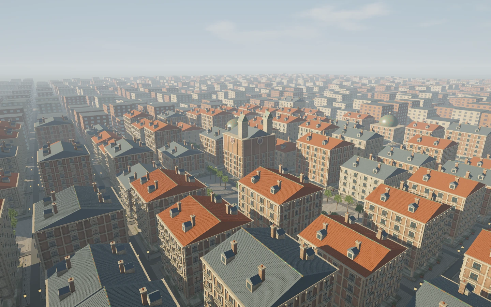
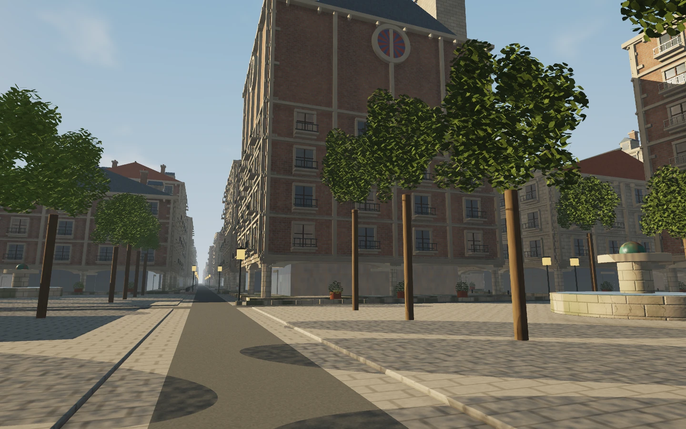
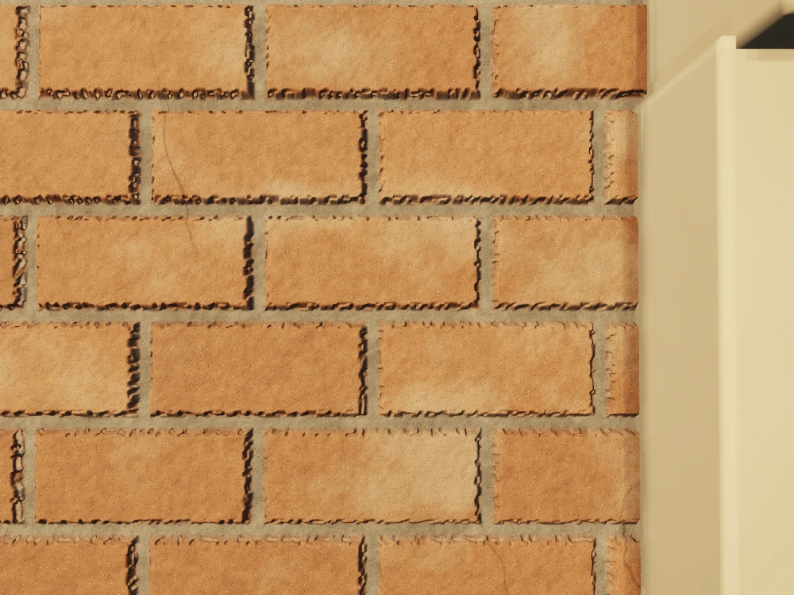
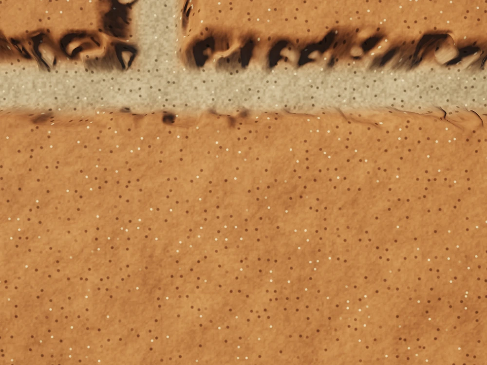

# STRATUM
## The city is code.

**[Fly the city](https://samg-coder.github.io/stratum-hyperdetail/)** · [GPU checks](https://samg-coder.github.io/stratum-hyperdetail/tests/browser.html)

A fly-through procedural city renderer. CUDA source generates the scene, selects detail, fills a GPU geometry cache, constructs acceleration structures, traces visibility, evaluates materials, trains an optional small material surrogate, and produces the image.

**No imported meshes. No world texture maps. No downloaded scene assets. No enemies or gameplay.** The city is generated from a seed and `.cu` definitions. A small JavaScript host handles browser input, GPU resources, dispatch, the HTML interface, and presenting the finished image.

This is a working-source renderer prototype, not a claim of production readiness, full neural rendering, an infinite planet, or an implementation of Unreal Engine's Nanite. Its cached representation consists of **analytic geometric primitives**, not virtualized triangle meshes.



*The included previews were rendered from the authored CUDA functions using the native CPU reference harness, with four (street) or eight (other views) stationary accumulation samples. They are not image-generator artwork, browser screenshots, or proof of GPU frame rate. The cooperative GPU sort is replaced by an independent CPU sort in that harness.*

## Run

Extract the entire project, then double-click **START.bat** on Windows. Requires **Node.js 20+** and a browser with working WebGPU. No npm installation, API key, model download, or account is needed.

Alternatively:

```sh
node server.mjs
```

Open **http://localhost:8089**. Keep the terminal open. Use `./start.sh` on macOS/Linux. Another port can be supplied with `node server.mjs 8090`.

Do not open `index.html` using `file://`. Use the local server, the public GitHub Pages build, or another HTTPS host. The local server binds to this machine only. WebGPU needs localhost or HTTPS.

Desktop starts at **High: 1600 internal pixels wide**. Ultra is 1920. Balanced is 1024 and Performance is 768. Height follows the window's aspect ratio; the buffer dimensions are padded to copy/workgroup alignment. Coarse-pointer devices default to 768 to limit allocation, but this build primarily targets keyboard-and-mouse flight. The view buttons and drag-to-look work without a keyboard; there is no complete touch flight controller.

## Explore it

| Control | Action |
|---|---|
| WASD / arrows | Fly forward, backward and sideways |
| Drag the mouse | Look around; the cursor stays visible |
| Q / E | Down / up; Space also moves up |
| Shift / Ctrl | Fast travel / precision movement |
| Mouse wheel | Change movement speed, from close inspection to city traversal |
| 1 | Skyline |
| 2 | Street and arcades |
| 3 | Masonry inspection |
| 4 | City overview |
| 5 | Canal |
| 6 | Very close surface grain |
| P | Toggle the orbit camera |
| [ / ] | Rotate the sun |
| - / + | Exposure |
| V | Cycle lit image, cache pages, primitive clusters and normals |
| G | Freeze/resume new geometry generation |
| N | Request neural substrate replacement; the quality gate still applies |
| T | Freeze/resume online material training |
| J | Toggle macro shadows |
| H / Tab | Open/close field notes |
| F | Fullscreen |
| C | Hide/show the interface |
| K | Save the actual computed frame as PNG |

Camera movement is free flight, not collision-constrained walking. Avoid flying inside a wall. The close-up bookmarks position the camera outside the central building for the selected seed.

The field notes show actual cached primitive counts, resident pages, pages generated and reused, pending requests, buffer allocation, neural errors and optimizer updates. GPU stage timings use WebGPU timestamp queries when the adapter exposes them. When unavailable, timings remain unavailable rather than substituting made-up values. The FPS indicator counts completed frame submissions; no target hardware performance is claimed.

## What gets generated

The current world contains **64 × 64 lots at 36 metres per lot: 4,096 plots spanning 2.304 km on each side**. Some plots are parks or canal sections rather than buildings. It is a finite city, with a simple surrounding ground plane.

The architecture includes arcaded ground floors, columns and capitals, multi-storey facades, windows and mullions, balconies and railings, cornices and dentils, corner stonework, pitched roofs with seams, dormers and chimneys, copper domes, and a central tower building with rose-window details. Parks contain fountains, planters, trunks and ray-generated leaves. Canal sections, bridges, lamps, paving and sidewalks are generated by the same asset kernels.

Individual leaves are thin, ray-intersected shapes inside bounded foliage regions; the enclosing regions are not painted as opaque spheres. Visible occlusion is resolved by nearest 3D intersection rather than painter-ordered transparent sprites.

Masonry uses world-space brick/stone layouts, bounded ray-evaluated mortar relief and chipped edges. Smaller mineral inclusions, pores, grain, cracks, weathering and surface roughness are procedural appearance signals, filtered using the pixel's projected footprint. **Not every pore is separate geometry.** No polygon-equivalent count is invented for these signals.







## Compute streaming

The scene description is compact; generated geometry still requires GPU time and GPU memory. This replaces world asset-file streaming with bounded generation and reuse. It does not eliminate residency management or make visible detail free.

The implemented path is:

```text
Seed + CUDA asset definitions
           |
    Coarse city descriptors
           |
GPU view tests + projected-detail selection
           |
   Prioritized page requests
           |
  Generate up to 6 pages per frame
           |
 Morton sort -> per-page BVH build
           |
   Commit the finished cache pages
           |
 City-grid traversal -> nearest primitive hit
           |
 Procedural materials + optional neural substrate
           |
 Sun / sky / macro shadows / contact occlusion
           |
 Stationary accumulation -> tone map -> RGBA canvas
```

The fixed cache has **256 page slots**. Each slot accommodates **64 clusters of 32 primitive slots**, or 2,048 primitive slots. A page contains one generated lot at one of three detail levels. Selection uses projected scale and hysteresis; it is **deterministic, not neural**. Generation has a fixed budget of six pages per frame. No CPU loop decides which individual building primitive should be drawn.

Generated primitives are cooperatively Morton-sorted on the GPU. Each page has a binary bounding-volume hierarchy. Rendering traverses a coarse city grid and then the appropriate page hierarchy; distant or uncached lots use coarse silhouettes. The cache is direct-mapped by world-cell coordinates. A tag check prevents a newly visited cell from using another cell's page. Replacement data becomes visible only after generation, sorting and all hierarchy levels are complete.

The primitive, hierarchy, index and metadata allocations together are approximately **66 MiB**. Frame buffers and other working state are additional and shown separately in the interface. The cache does not grow with the camera's travel distance. A stationary settled view regenerates no pages, although the bounded scheduling and traversal passes still run.

## The neural part: deliberately optional

A **291-parameter, 8 → 24 tanh → 3 network** learns the low-frequency stone/brick substrate colour from the procedural teacher. It does not generate the city layout, choose geometric LOD, invent missing geometry, or replace the whole frame.

Every fourth rendered frame, the learning kernels sample visible masonry surfaces. A batch reserves up to 56 valid samples for training and up to eight different batch entries for scoring. The score is computed before the optimizer update; the scoring entries are excluded from that update's gradient. This is an online per-batch split, **not a permanently disjoint dataset**: a surface can be sampled again on a later frame.

The implementation contains the actual forward pass, derivatives, gradient averaging/clipping and AdamW. The baseline is each material's constant mean colour. The replacement gate requires at least 256 scored observations, a running RGB MSE below 90% of the baseline error, and an absolute MSE below 0.0012. Those are explicit engineering thresholds, not a proof of perceptual equivalence.

Training is enabled initially, but **replacement is OFF**. Press N to request it. The gate can keep the procedural teacher active. Once allowed, the network replaces the more expensive substrate calculation; joints, pores, grain and all geometry remain procedural. T freezes learning. Neural weights reset on a new page load; persistence is not implemented in this renderer.

The gate is a running view-sample metric, not spatially calibrated uncertainty. It can lag when the view changes. The shown error is scored before the latest update, not a full validation of all post-update weights over every world location. The network may change appearance or fail the gate. No speed-up is guaranteed; training and inference themselves cost GPU work.

## Source map

| File | Responsibility |
|---|---|
| `kernels/common.cu` | Dimensions, integer hashing, math, camera basis, material coordinates, relief |
| `kernels/world.cu` | World descriptors, camera, GPU visibility/LOD requests, scheduling and cache metadata |
| `kernels/assets.cu` | Buildings, parks, roofs, arcades, ornament, canal and street asset generators |
| `kernels/cache.cu` | Shared-memory Morton sorting and BVH construction |
| `kernels/trace.cu` | Analytic primitive intersection, leaf generation, BVH/city traversal |
| `kernels/materials.cu` | Procedural surface signals, sky, neural substrate features/inference |
| `kernels/learning.cu` | Online teacher samples, scoring, gradients and AdamW |
| `kernels/shade.cu` | Lighting, shadows, shading, contact occlusion, accumulation and final pixels |
| `Stratum.cu` | Generated combined copy of the eight source files |
| `src/engine.js` | GPU allocation, kernel binding/dispatch, timestamps, presentation and readback |
| `src/app.js`, `index.html`, `style.css` | Browser input, controls, HTML field notes and launch/error UI |
| `vendor/cuda-webshader/` | Vendored upstream compiler/runtime and preserved notices |

The maintained scene/rendering source is CUDA; WGSL is compiler output. No Three.js scene or hand-written WGSL renderer is used. The browser interface is HTML/CSS/JavaScript rather than CUDA. The project uses the CUDA subset supported by the vendored compiler, not arbitrary CUDA host libraries or hardware CUDA execution in the browser.

## Rebuild

```sh
npm run build
npm test
npm run pages
```

`build` translates all **18 entry points**, updates the readable generated WGSL and portable compiler artifacts, and regenerates `Stratum.cu`. Editing split `.cu` files requires a rebuild. Opening the application with `?compile=1` recompiles the split sources in the browser instead.

`pages` writes a static `dist/` folder for an HTTPS host. It includes the real-WebGPU test page. GitHub Actions on `main` runs `npm test`, packages that folder, and deploys [GitHub Pages](https://samg-coder.github.io/stratum-hyperdetail/).

The combined `.cu` file is a **multi-kernel program**. It requires this project's buffer layout, repeated BVH dispatches, pass ordering and browser host. It is not a one-kernel sandbox paste-in or a standalone `.exe`.

Useful URL options:

```text
?width=1024
?width=1920&seed=42
?compile=1
```

## Tests and limitations

**Browser shader execution, hardware GPU performance and cross-driver behaviour have not been verified in the build environment.** Browser navigation was blocked there. There is no hidden CPU fallback in the shipped browser application.

On your machine, open **http://localhost:8089/tests/browser.html** and press **Run GPU checks**. The same page is deployed at [https://samg-coder.github.io/stratum-hyperdetail/tests/browser.html](https://samg-coder.github.io/stratum-hyperdetail/tests/browser.html). It asks your real adapter to compile shaders, create procedural cache pages, run the GPU sort/BVH/render path, train weights and test freezing. The results page prints actual measurements or errors.

Performed here: all 18 entries translated with the bundled compiler; four source/runtime-contract tests passed; CPU reference tests checked BVH hits against exhaustive intersections on 200 rays, finite output and bounded cache reuse, and all 291 network gradients against finite differences. See [validation details](docs/VALIDATION.md) and the attached logs.

The scene has repeated architectural rules, three discrete geometry detail levels and a finite cache radius. Coarse/detailed transitions can be visible, especially during rapid flight. Shadows use macro buildings and approximate foliage, not full fine-geometry ray-traced lighting. Reflections sample the procedural sky, not the reflected full city. Temporal accumulation applies to a stationary camera and resets on movement/new geometry; it is not motion-vector temporal reconstruction. The current goal is an inspectable procedural-compute renderer, not photogrammetry quality or a proven replacement for a production engine.

## Provenance

The CUDA WebShader compiler/runtime was vendored from the existing Nocturne project package used in this conversation. Upstream copyright and third-party notices remain under `vendor/cuda-webshader/`. STRATUM's new application and kernels use the root MIT license. There are no distributed font files, external textures, mesh files, audio recordings or pretrained weights. Images under `docs/` are optional documentation previews and are not loaded as scene assets.


## Hyperdetail / continuous projected refinement branch

Hyperdetail removes discrete geometry LOD replacement for resident lots. A cached lot is the same deterministic full-detail structure at every camera distance. Projected footprint is instead used to continuously filter high-frequency procedural appearance, while uncached/distant facades evaluate seeded windows, frames, courses, corner stonework and balcony cues directly at the ray hit.

Each procedural page remains at the WebGPU-safe **2,048 primitive slots**, split into **64 × 32 deterministic clusters**. Cached lots are now generated once at their full authored detail instead of being regenerated when a distance threshold changes. The extra near-camera capacity is spent on deterministic facade and environment structure: deeper window frames, paired pane divisions, sill drip edges, upper reveals, additional facade courses, balcony rail caps/supports/brackets, downpipes, curb furniture, pavement edge detail, roof vents, flashing and antenna supports.

These are not separate near/far building meshes. They are higher-frequency evaluations of the same lot seed and facade layout. Fine material frequencies continue to use projected-footprint filtering, while geometric features enter only when their projected scale justifies their ray-intersection cost.

The cache remains bounded and does not grow with travel distance, and its 16×16 physical footprint is biased several lots toward the viewing direction so upcoming inspection-scale buildings are materialised earlier. Cache residency is no longer a representation switch: every ray evaluates the deterministic procedural building, and a resident page only refines that result with full analytic geometry. Far-field procedural facade evaluation preserves architectural frequency outside the cache without allocating another geometry page. Macro intersection now also evaluates deterministic pitched-roof bands, chimneys, dormer masses, domes, tower crowns, spires and roof services directly from the lot seed, so uncached buildings retain a structured silhouette rather than collapsing to a tall box. This follows the same principle used by ARBOR's ray-generated foliage: preserve image-relevant structure by evaluating the compact procedural definition at ray time.
